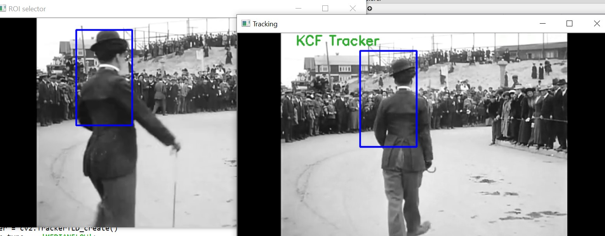
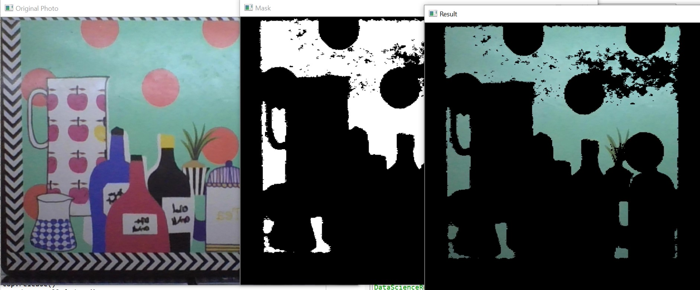
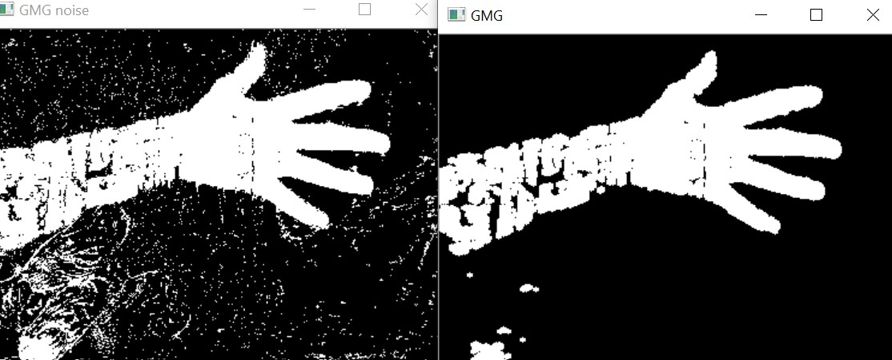
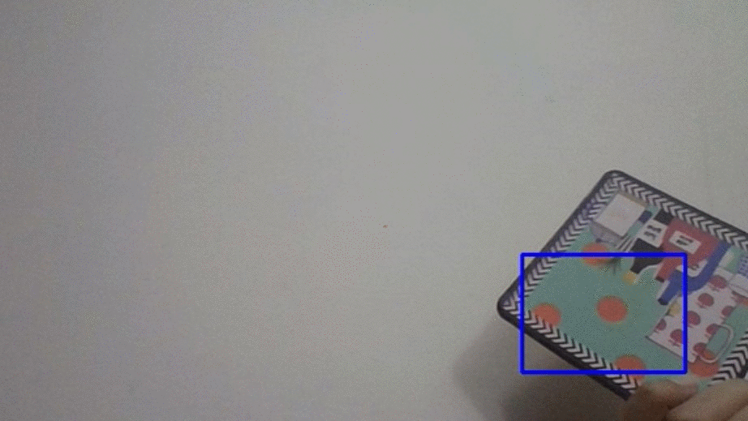

# Object Tracking 
Using OpenCV to track objects in video feed
## Getting Started
Download the repository and run each code using:
> Python == 3.5
>
> OpenCV == 3.4.1
>
## Details
| File | Information |
|-------|------------|
| Demo38_TrackingAlgorithms.py  | Algorithms implementation using bounding box | 
| Demo39_ColorFilteringForTracking.py  | Color tracking  | 
| Demo40_BGSubtraction.py  | Background subtraction  | 
| Demo41_RemoveNoise.py  | Noise removal in background segmentation  | 
| algorithms.jpg  | output of Demo38 | 
| colorfiltering.jpg  | output of Demo39 | 
| noiseRemoval.jpg  | output of Demo41 | 
| videos  | Video for Algorithm implementation  | 
| Demo46_TrackingMeanshift.py | Meanshift Live implementation |
| Demo47_TrackingCamShift.py | Camshift Live implementation |
| hueValues.png | Hue values for color specification |
| outputcamshift.webm | Output video for CamShift |
## Algorithms output

## Color filtering

## BGFG segmentation

## MeanShift Tracking

